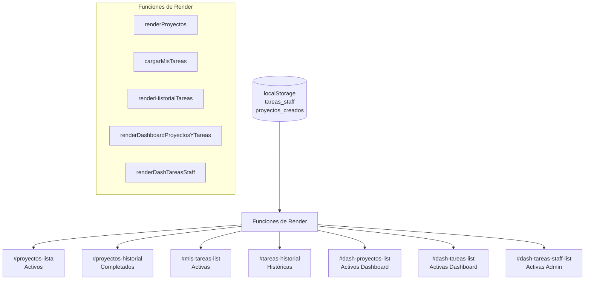
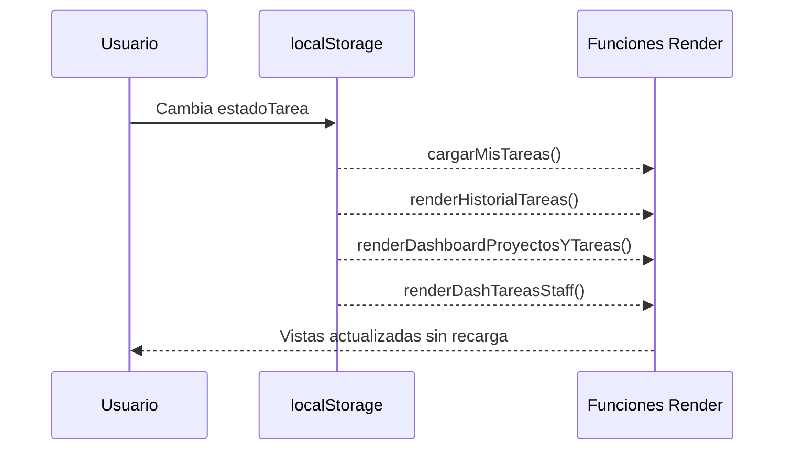

# Documento de Diseño Técnico
# Feature: dashboard-history-cleanup

---

## Visión General

Esta feature consolida y completa la separación entre contenido activo e histórico en el dashboard ERP. El objetivo es que cada vista (Dashboard principal, Vista Proyectos, Vista Staff) muestre únicamente los elementos vigentes en sus paneles activos, y desplace los elementos finalizados a secciones de historial claramente delimitadas.

El sistema ya cuenta con infraestructura parcial: `calcularEstadoProyecto()`, `renderProyectos()` con separación activos/historial, `cargarMisTareas()` y `renderHistorialTareas()` con lógica de filtrado, y los contenedores HTML `#proyectos-historial` y `#tareas-historial`. Lo que falta es completar los gaps de filtrado en `renderDashboardProyectosYTareas()` y `renderDashTareasStaff()`, y garantizar la sincronización en tiempo real entre vistas al cambiar el estado de una tarea.

---

## Arquitectura

El sistema es una SPA (Single Page Application) en HTML/CSS/JS vanilla sin frameworks. Toda la persistencia ocurre en `localStorage`. No hay backend ni llamadas HTTP.



### Flujo de actualización en tiempo real

Cuando el usuario cambia el estado de una tarea desde cualquier vista, el sistema debe invocar el conjunto completo de funciones de render para mantener todas las vistas sincronizadas:



---

## Componentes e Interfaces

### Función: `calcularEstadoProyecto(p)` *(existente, sin cambios)*

```js
// Retorna: 'Planificado' | 'En curso' | 'Completado'
calcularEstadoProyecto(proyecto)
```

### Función: `esProyectoActivo(p)` *(nueva, helper)*

```js
// Retorna true si el estado NO es 'Completado'
function esProyectoActivo(p) {
    return calcularEstadoProyecto(p) !== 'Completado';
}
```

### Función: `esTareaHistorica(t)` *(nueva, helper)*

```js
// Retorna true si la tarea debe ir al historial
function esTareaHistorica(t) {
    const hoy = new Date(); hoy.setHours(0, 0, 0, 0);
    const esVencida    = t.vencimiento && new Date(t.vencimiento + 'T00:00:00') < hoy;
    const esCompletada = t.estadoTarea === 'completada' || t.estadoTarea === 'no-efectuado';
    return esVencida || esCompletada;
}
```

### Función: `renderProyectos()` *(existente, ajuste menor)*

- `#proyectos-lista`: solo proyectos donde `esProyectoActivo(p) === true`
- `#proyectos-historial`: solo proyectos donde `calcularEstadoProyecto(p) === 'Completado'`, ordenados de más reciente a más antiguo
- El filtro `#filtro-estado-proy` con valor `'Completado'` devuelve 0 resultados en `#proyectos-lista`
- Mensaje vacío activos: `'No hay proyectos activos.'`
- Mensaje vacío historial: `'Sin eventos en el historial.'`

### Función: `cargarMisTareas()` *(existente, sin cambios funcionales)*

- `#mis-tareas-list`: solo tareas donde `esTareaHistorica(t) === false`
- Filtro por usuario según rol (Admin ve todas, Staff/Siervo solo las propias)
- Mensaje vacío: `'Sin tareas activas.'`

### Función: `renderHistorialTareas()` *(existente, sin cambios funcionales)*

- `#tareas-historial`: solo tareas donde `esTareaHistorica(t) === true`
- Filtro por usuario según rol
- Ordenadas de más reciente a más antigua por `vencimiento`
- Mensaje vacío: `'Sin tareas en el historial.'`

### Función: `renderDashboardProyectosYTareas()` *(existente, requiere ajuste)*

- `#dash-proyectos-list`: aplicar `esProyectoActivo(p)` antes de renderizar
- `#dash-tareas-list`: aplicar `!esTareaHistorica(t)` antes de renderizar
- Mensaje vacío proyectos: `'Sin proyectos activos.'` (o mensaje de bienvenida para no-Admin)
- Mensaje vacío tareas: `'Sin tareas activas.'`
- Al cambiar estado de tarea desde el dashboard, invocar también `cargarMisTareas()` y `renderHistorialTareas()`

### Función: `renderDashTareasStaff()` *(existente, ya implementada correctamente)*

- Solo visible para Admin
- Filtra con `!esTareaHistorica(t)` — ya implementado correctamente
- Agrupa por área

---

## Modelos de Datos

### Proyecto (clave `proyectos_creados`)

```js
{
    nombre:         string,       // Nombre del evento
    fecha:          string,       // 'YYYY-MM-DD'
    hora:           string,       // 'HH:MM'
    areasData:      Array<{ area: string, cantidad: number }>,
    siervos:        number,
    desc:           string,
    fecha_registro: string        // ISO timestamp, usado como ID único
}
```

Estado calculado (no almacenado):
- `'Planificado'`: fecha futura
- `'En curso'`: fecha de hoy o pasada pero dentro del mismo día
- `'Completado'`: día siguiente o posterior a la fecha del evento

### Tarea (clave `tareas_staff`)

```js
{
    titulo:      string,
    desc:        string,
    asignado:    string,          // Nombre del usuario
    prioridad:   'Alta' | 'Media' | 'Baja',
    vencimiento: string,          // 'YYYY-MM-DD'
    estadoTarea: 'pendiente' | 'en-progreso' | 'completada' | 'no-efectuado',
    fecha:       string           // ISO timestamp, usado como ID único
}
```

Clasificación:
- **Tarea_Activa**: `vencimiento >= hoy` Y `estadoTarea` no es `'completada'` ni `'no-efectuado'`
- **Tarea_Historica**: `vencimiento < hoy` O `estadoTarea` es `'completada'` o `'no-efectuado'`

---

## Propiedades de Corrección

*Una propiedad es una característica o comportamiento que debe mantenerse verdadero en todas las ejecuciones válidas del sistema — esencialmente, una declaración formal sobre lo que el sistema debe hacer. Las propiedades sirven como puente entre las especificaciones legibles por humanos y las garantías de corrección verificables por máquinas.*

### Propiedad 1: Los paneles activos excluyen proyectos completados

*Para cualquier* conjunto de proyectos en localStorage, todos los proyectos cuyo `calcularEstadoProyecto()` retorne `'Completado'` deben estar ausentes de `#proyectos-lista`, `#dash-proyectos-list` y cualquier panel activo de proyectos.

**Valida: Requisitos 1.1, 1.2, 5.2**

### Propiedad 2: El historial de proyectos contiene solo completados

*Para cualquier* conjunto de proyectos en localStorage, todos los elementos renderizados en `#proyectos-historial` deben tener `calcularEstadoProyecto()` igual a `'Completado'`, y ningún proyecto activo debe aparecer en ese contenedor.

**Valida: Requisitos 2.1, 9.1, 9.3**

### Propiedad 3: Los paneles activos excluyen tareas históricas

*Para cualquier* conjunto de tareas en localStorage, todas las tareas donde `esTareaHistorica(t) === true` deben estar ausentes de `#mis-tareas-list`, `#dash-tareas-list` y `#dash-tareas-staff-list`.

**Valida: Requisitos 3.2, 6.2, 7.2**

### Propiedad 4: El historial de tareas contiene solo tareas históricas

*Para cualquier* conjunto de tareas en localStorage, todos los elementos renderizados en `#tareas-historial` deben satisfacer `esTareaHistorica(t) === true`, y ninguna tarea activa debe aparecer en ese contenedor.

**Valida: Requisitos 4.1, 9.2, 9.4**

### Propiedad 5: El historial de proyectos está ordenado de más reciente a más antiguo

*Para cualquier* lista de proyectos completados, el orden de renderizado en `#proyectos-historial` debe ser descendente por fecha de evento: para todo par de proyectos adyacentes `(a, b)` en la lista renderizada, `fecha(a) >= fecha(b)`.

**Valida: Requisito 2.2**

### Propiedad 6: El historial de tareas está ordenado de más reciente a más antiguo

*Para cualquier* lista de tareas históricas, el orden de renderizado en `#tareas-historial` debe ser descendente por fecha de vencimiento: para todo par de tareas adyacentes `(a, b)`, `vencimiento(a) >= vencimiento(b)`.

**Valida: Requisito 4.2**

### Propiedad 7: Cambio de estado sincroniza todas las vistas

*Para cualquier* tarea cuyo `estadoTarea` cambia a `'completada'`, después de la actualización en localStorage, la tarea debe estar ausente de todos los paneles activos y presente en `#tareas-historial`, sin necesidad de recargar la página.

**Valida: Requisitos 8.1, 8.2, 8.3**

### Propiedad 8: El filtro 'Completado' no muestra resultados en el panel activo

*Para cualquier* conjunto de proyectos, cuando el selector `#filtro-estado-proy` tiene el valor `'Completado'`, el contenedor `#proyectos-lista` debe renderizar cero elementos de proyecto.

**Valida: Requisito 1.4**

---

## Manejo de Errores

| Situación | Comportamiento esperado |
|---|---|
| `localStorage` vacío o clave inexistente | Tratar como array vacío `[]`; mostrar mensaje de estado vacío correspondiente |
| Proyecto sin campo `fecha` | `calcularEstadoProyecto()` retorna `'Planificado'`; el proyecto aparece en activos |
| Tarea sin campo `vencimiento` | `esTareaHistorica()` evalúa solo `estadoTarea`; si es `'pendiente'` o `'en-progreso'`, va a activos |
| Tarea sin campo `estadoTarea` | Se trata como `'pendiente'` (valor por defecto) |
| Contenedor HTML no encontrado | La función de render retorna sin error (`if (!el) return`) |
| Cambio de estado desde dashboard cuando vista Staff no está activa | Se invoca `cargarMisTareas()` y `renderHistorialTareas()` de todas formas para mantener consistencia |

---

## Estrategia de Testing

### Enfoque dual

Se utilizan dos tipos de tests complementarios:

- **Tests unitarios (ejemplos)**: verifican casos concretos, casos borde y condiciones de error
- **Tests de propiedades (property-based)**: verifican propiedades universales con entradas generadas aleatoriamente

Los tests unitarios cubren ejemplos específicos; los tests de propiedades garantizan corrección general. Ambos son necesarios.

### Librería de property-based testing

Se usará **[fast-check](https://github.com/dubzzz/fast-check)** (JavaScript), ejecutado con Jest o Vitest.

Configuración mínima: **100 iteraciones por propiedad** (parámetro `numRuns: 100`).

### Tests unitarios (ejemplos y casos borde)

```
- Proyecto con fecha pasada → aparece en historial, no en activos
- Proyecto con fecha futura → aparece en activos, no en historial
- Tarea con estadoTarea='completada' → aparece en historial, no en activos
- Tarea con vencimiento ayer y estadoTarea='pendiente' → aparece en historial
- Tarea con vencimiento mañana y estadoTarea='pendiente' → aparece en activos
- localStorage vacío → todos los paneles muestran mensaje de estado vacío
- Proyecto sin campo 'fecha' → tratado como Planificado (activo)
- Tarea sin campo 'vencimiento' → clasificada solo por estadoTarea
- Filtro 'Completado' en #filtro-estado-proy → #proyectos-lista vacío
- Cambio de estado a 'completada' → tarea desaparece de activos y aparece en historial
```

### Tests de propiedades

Cada propiedad del diseño se implementa como un único test de propiedad con fast-check.

**Formato de etiqueta:** `Feature: dashboard-history-cleanup, Propiedad {N}: {texto}`

```js
// Propiedad 1: Los paneles activos excluyen proyectos completados
// Feature: dashboard-history-cleanup, Propiedad 1: paneles activos excluyen proyectos completados
fc.assert(fc.property(fc.array(proyectoArbitrario()), proyectos => {
    // Dado un array aleatorio de proyectos, ningún completado aparece en activos
    const activos = proyectos.filter(p => calcularEstadoProyecto(p) !== 'Completado');
    return activos.every(p => calcularEstadoProyecto(p) !== 'Completado');
}), { numRuns: 100 });

// Propiedad 2: El historial de proyectos contiene solo completados
// Feature: dashboard-history-cleanup, Propiedad 2: historial contiene solo completados
fc.assert(fc.property(fc.array(proyectoArbitrario()), proyectos => {
    const historial = proyectos.filter(p => calcularEstadoProyecto(p) === 'Completado');
    return historial.every(p => calcularEstadoProyecto(p) === 'Completado');
}), { numRuns: 100 });

// Propiedad 3: Los paneles activos excluyen tareas históricas
// Feature: dashboard-history-cleanup, Propiedad 3: paneles activos excluyen tareas históricas
fc.assert(fc.property(fc.array(tareaArbitraria()), tareas => {
    const activas = tareas.filter(t => !esTareaHistorica(t));
    return activas.every(t => !esTareaHistorica(t));
}), { numRuns: 100 });

// Propiedad 4: El historial de tareas contiene solo tareas históricas
// Feature: dashboard-history-cleanup, Propiedad 4: historial contiene solo tareas históricas
fc.assert(fc.property(fc.array(tareaArbitraria()), tareas => {
    const historial = tareas.filter(t => esTareaHistorica(t));
    return historial.every(t => esTareaHistorica(t));
}), { numRuns: 100 });

// Propiedad 5: Historial de proyectos ordenado descendente
// Feature: dashboard-history-cleanup, Propiedad 5: historial proyectos ordenado descendente
fc.assert(fc.property(fc.array(proyectoCompletadoArbitrario(), { minLength: 2 }), proyectos => {
    const ordenados = [...proyectos].sort((a, b) => new Date(b.fecha) - new Date(a.fecha));
    for (let i = 0; i < ordenados.length - 1; i++) {
        if (new Date(ordenados[i].fecha) < new Date(ordenados[i+1].fecha)) return false;
    }
    return true;
}), { numRuns: 100 });

// Propiedad 6: Historial de tareas ordenado descendente
// Feature: dashboard-history-cleanup, Propiedad 6: historial tareas ordenado descendente
fc.assert(fc.property(fc.array(tareaHistoricaArbitraria(), { minLength: 2 }), tareas => {
    const ordenadas = [...tareas].sort((a, b) => new Date(b.vencimiento) - new Date(a.vencimiento));
    for (let i = 0; i < ordenadas.length - 1; i++) {
        if (new Date(ordenadas[i].vencimiento) < new Date(ordenadas[i+1].vencimiento)) return false;
    }
    return true;
}), { numRuns: 100 });

// Propiedad 7: Cambio de estado sincroniza vistas
// Feature: dashboard-history-cleanup, Propiedad 7: cambio de estado sincroniza vistas
fc.assert(fc.property(tareaActivaArbitraria(), tarea => {
    const tareaCompletada = { ...tarea, estadoTarea: 'completada' };
    return esTareaHistorica(tareaCompletada) === true;
}), { numRuns: 100 });

// Propiedad 8: Filtro 'Completado' vacía el panel activo
// Feature: dashboard-history-cleanup, Propiedad 8: filtro Completado vacía panel activo
fc.assert(fc.property(fc.array(proyectoArbitrario()), proyectos => {
    // Con filtro 'Completado', el panel activo debe tener 0 elementos
    const resultado = proyectos.filter(p => calcularEstadoProyecto(p) === 'Completado' && calcularEstadoProyecto(p) !== 'Completado');
    return resultado.length === 0;
}), { numRuns: 100 });
```

### Generadores arbitrarios (fast-check)

```js
const proyectoArbitrario = () => fc.record({
    nombre: fc.string({ minLength: 1 }),
    fecha:  fc.date({ min: new Date('2020-01-01'), max: new Date('2030-12-31') })
              .map(d => d.toISOString().split('T')[0]),
    hora:   fc.constantFrom('08:00', '10:00', '18:00', '20:00'),
    fecha_registro: fc.date().map(d => d.toISOString())
});

const tareaArbitraria = () => fc.record({
    titulo:      fc.string({ minLength: 1 }),
    asignado:    fc.string({ minLength: 1 }),
    estadoTarea: fc.constantFrom('pendiente', 'en-progreso', 'completada', 'no-efectuado'),
    vencimiento: fc.date({ min: new Date('2020-01-01'), max: new Date('2030-12-31') })
                   .map(d => d.toISOString().split('T')[0]),
    fecha:       fc.date().map(d => d.toISOString())
});
```
