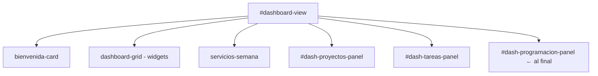

# Diseño Técnico: Panel de Programación en Dashboard

## Visión General

Esta funcionalidad extiende el panel `#dash-programacion-panel` del dashboard para que todos los roles (Admin, Staff, Siervo) puedan ver los PDFs de programación subidos por el Admin. El panel muestra los archivos activos agrupados por servicio, permite abrirlos como modal, y mueve los expirados a un historial colapsable.

La lógica ya existe parcialmente en `dashboard.js` (funciones `renderDashProgramacion`, `esPdfExpirado`, `getFechasServicio`, `abrirDocPreview`). El trabajo consiste en corregir y completar esa implementación para que cumpla todos los requisitos aprobados.

## Arquitectura

El sistema es una SPA vanilla JS sin frameworks. Toda la lógica del dashboard vive en `dashboard.js`, que se ejecuta en el contexto del `DOMContentLoaded`. Los datos se leen desde `localStorage` (sincronizado con Firebase Realtime Database mediante la capa de compatibilidad existente).

```
Firebase Realtime DB
       │  (listenPdfs → onValue)
       ▼
localStorage['recursos_pdfs']
       │
       ▼
renderDashProgramacion()
  ├── esPdfExpirado(p)          ← clasifica cada PDF
  ├── filtrarPorRol()           ← Admin: todos / Staff+Siervo: por servicios reservados
  ├── renderActivos()           ← agrupa por servicio_key, muestra separadores
  └── renderHistorial()         ← colapsable, PDFs expirados
       │
       ▼
#dash-programacion-panel  (al final de #dashboard-view)
```

El panel se re-renderiza en tres momentos:
1. Al cargar el dashboard (`DOMContentLoaded`).
2. Cada 60 segundos via `setInterval`.
3. Al recibir cambios en tiempo real desde Firebase (`DB.listenPdfs`).

## Componentes e Interfaces

### `esPdfExpirado(p: PDF): boolean`

Ya existe. Calcula si el servicio asociado al PDF ya ocurrió (más `EXPIRY_OFFSET_MS` = 45 min).

- Si `p.servicio` es `''` o `null` → retorna `false` (General, nunca expira).
- Si `p.servicio` no está en el mapa de horas → retorna `false`.
- Calcula la fecha del servicio más reciente pasado para ese `servicio_key` y compara con `Date.now() + EXPIRY_OFFSET_MS`.

### `getFechasServicio(servicioKey: string): string`

Ya existe. Retorna una cadena legible con la fecha del próximo servicio (ej. `"18 may · 7:30 AM"`). Se usa para mostrar el subtítulo de cada tarjeta y el texto de los separadores.

### `renderDashProgramacion(): void`

Función principal. Orquesta todo el renderizado del panel. Flujo:

1. Lee `localStorage['recursos_pdfs']`.
2. Si no hay PDFs → oculta el panel y retorna.
3. Filtra PDFs relevantes según rol (ver sección Data Models).
4. Si no hay relevantes → oculta el panel y retorna.
5. Separa en `activos` y `expirados` usando `esPdfExpirado`.
6. Si no hay activos ni expirados → oculta el panel y retorna.
7. Muestra el panel.
8. Renderiza sección activa agrupada por `servicio_key`.
9. Si hay expirados, renderiza historial colapsable.
10. Adjunta event listeners para abrir modal.

### `renderPdfCard(p: PDF, pdfs: PDF[]): HTMLElement`

Función interna de `renderDashProgramacion`. Genera la tarjeta de un PDF:
- Ícono 📄
- Título (`p.titulo`)
- Subtítulo: si `p.servicio` → `SERVICIOS_LABEL[p.servicio] + ' — ' + getFechasServicio(p.servicio)`; si no → `"General"`

### `abrirDocPreview(p: PDF): void`

Ya existe. Abre el modal `#doc-preview-modal` con el contenido del PDF. No requiere cambios.

### Posicionamiento del panel en el DOM

El panel `#dash-programacion-panel` ya existe en `dashboard.html` antes de la sección de proyectos/tareas. Según el Requisito 7, debe estar **al final** del `#dashboard-view`. Se moverá al final mediante JS en `renderDashProgramacion` (o al inicializar el dashboard), usando `appendChild` sobre `#dashboard-view`.



### Intervalo de actualización

```javascript
setInterval(renderDashProgramacion, 60000);
```

Se registra una sola vez al inicializar el dashboard.

## Modelos de Datos

### PDF (desde `localStorage['recursos_pdfs']`)

```typescript
interface PDF {
  titulo: string;          // Texto principal de la tarjeta
  url: string;             // Data URL o URL remota del archivo
  esLocal: boolean;        // true si es data URL base64
  nombreArchivo: string;   // Nombre del archivo con extensión
  servicio: string;        // 'dom-1'|'dom-2'|'dom-3'|'dom-4'|'mie-1'|''
  fecha: string;           // ISO string de cuándo fue subido
}
```

### Servicio Reservado (desde `localStorage['servicios_reservados']`)

```typescript
interface ServicioReservado {
  usuario: string;   // Nombre del usuario que reservó
  servicio: string;  // Ej: "Domingo a las 7:30 AM"
  // ...otros campos
}
```

### Mapeo Servicio_Key → Horario

```javascript
const SERVICIOS_HORA = {
  'dom-1': { dia: 0, h: 7,  m: 30 },
  'dom-2': { dia: 0, h: 11, m: 0  },
  'dom-3': { dia: 0, h: 13, m: 0  },
  'dom-4': { dia: 0, h: 19, m: 0  },
  'mie-1': { dia: 3, h: 19, m: 0  }
};
```

### Lógica de filtrado por rol

```
Admin:
  relevantes = todos los PDFs

Staff / Siervo:
  misKeys = servicios_reservados
              .filter(s => s.usuario === sesion.nombre)
              .map(s => parsearServicioKey(s.servicio))
  relevantes = pdfs.filter(p => p.servicio === '' || misKeys.has(p.servicio))
```

La función `parsearServicioKey` convierte el string de reserva (ej. `"Domingo a las 7:30 AM"`) al `servicio_key` correspondiente (`"dom-1"`).

## Propiedades de Corrección

*Una propiedad es una característica o comportamiento que debe mantenerse verdadero en todas las ejecuciones válidas del sistema — esencialmente, una declaración formal sobre lo que el sistema debe hacer. Las propiedades sirven como puente entre las especificaciones legibles por humanos y las garantías de corrección verificables por máquina.*

### Propiedad 1: Visibilidad del panel según PDFs activos relevantes

*Para cualquier* sesión de usuario (Admin, Staff o Siervo) y cualquier conjunto de PDFs en `localStorage`, si existe al menos un PDF activo relevante para ese usuario, el panel `#dash-programacion-panel` debe ser visible; si no existe ninguno, debe estar oculto.

**Valida: Requisitos 1.1, 1.4**

### Propiedad 2: Filtrado correcto por rol

*Para cualquier* sesión de Staff o Siervo con un conjunto de servicios reservados y un conjunto de PDFs, los PDFs renderizados en la sección activa deben ser exactamente aquellos cuyo `servicio` está en los `servicio_key` reservados por el usuario, más los PDFs con `servicio === ''`.

**Valida: Requisitos 1.2, 1.3**

### Propiedad 3: Clasificación de expiración de PDFs

*Para cualquier* PDF con un `servicio_key` válido, `esPdfExpirado(p)` debe retornar `true` si y solo si el tiempo actual supera la fecha del servicio más reciente correspondiente a ese `servicio_key` más `EXPIRY_OFFSET_MS` (45 minutos). Para PDFs con `servicio === ''`, debe retornar siempre `false`.

**Valida: Requisitos 4.1, 4.4, 6.1, 6.2, 6.3**

### Propiedad 4: Completitud del renderizado de tarjetas

*Para cualquier* PDF activo relevante, la tarjeta renderizada debe contener el `titulo` del PDF como texto principal y el `Horario_Servicio` (o "General") como subtítulo.

**Valida: Requisitos 2.1, 2.2, 2.3**

### Propiedad 5: Agrupación y separadores por servicio

*Para cualquier* conjunto de PDFs activos con múltiples `servicio_key` distintos, el renderizado debe producir exactamente un separador por cada `servicio_key` no-general presente, y ningún separador para grupos donde todos los PDFs están expirados.

**Valida: Requisitos 2.4, 4.5**

### Propiedad 6: Historial contiene todos los expirados relevantes

*Para cualquier* sesión de usuario y conjunto de PDFs, la sección de historial debe contener exactamente todos los PDFs expirados relevantes para ese usuario, ni más ni menos.

**Valida: Requisitos 5.1, 5.2, 5.5**

## Manejo de Errores

| Situación | Comportamiento |
|---|---|
| `localStorage['recursos_pdfs']` vacío o inválido | Panel oculto, sin error visible |
| `localStorage['servicios_reservados']` vacío | Staff/Siervo solo ven PDFs General |
| `getFechasServicio` retorna `''` | Subtítulo muestra solo el label del servicio sin fecha |
| `abrirDocPreview` con PDF sin URL válida | Modal muestra opción de descarga en lugar de preview |
| `servicio_key` desconocido en un PDF | PDF tratado como General (no expira) |
| Error al parsear JSON de localStorage | Se usa array vacío como fallback (`|| '[]'`) |

## Estrategia de Testing

### Tests unitarios (ejemplo-based)

Cubren comportamientos específicos y casos borde:

- `esPdfExpirado` con `servicio === ''` → siempre `false`
- `esPdfExpirado` con `servicio_key` desconocido → `false`
- `renderDashProgramacion` con PDFs vacíos → panel oculto
- `renderDashProgramacion` con todos expirados → panel oculto (sin activos)
- Historial colapsado por defecto (clase `collapsed` presente)
- Click en tarjeta llama `abrirDocPreview` con el PDF correcto
- Panel posicionado al final de `#dashboard-view`
- `setInterval` registrado con 60000ms

### Tests de propiedades (property-based)

Se usará **fast-check** (JavaScript) con mínimo 100 iteraciones por propiedad.

Cada test referencia su propiedad de diseño con el tag:
`// Feature: recursos-programacion-dashboard, Property N: <texto>`

**Propiedad 1 — Visibilidad del panel:**
Generar arrays aleatorios de PDFs (con mezcla de activos/expirados) y sesiones de cualquier rol. Verificar que el panel es visible ↔ existe al menos un PDF activo relevante.

**Propiedad 2 — Filtrado por rol:**
Generar PDFs con `servicio_key` aleatorios y reservas de servicios aleatorias para un usuario Staff/Siervo. Verificar que el conjunto renderizado es exactamente la intersección correcta.

**Propiedad 3 — Clasificación de expiración:**
Generar PDFs con `servicio_key` válidos y mockear `Date.now()` a valores antes/después del umbral de expiración. Verificar que `esPdfExpirado` retorna el valor correcto en cada caso.

**Propiedad 4 — Completitud de tarjetas:**
Generar PDFs con títulos y servicios aleatorios. Verificar que el HTML renderizado contiene el `titulo` y el subtítulo correcto para cada uno.

**Propiedad 5 — Agrupación y separadores:**
Generar PDFs con múltiples `servicio_key`. Verificar que el número de separadores en la sección activa es igual al número de `servicio_key` únicos no-general con al menos un PDF activo.

**Propiedad 6 — Historial completo:**
Generar mezclas de PDFs activos y expirados. Verificar que el historial contiene exactamente los expirados relevantes.

### Tests de integración

- Verificar que `DB.listenPdfs` dispara `renderDashProgramacion` al recibir datos nuevos.
- Verificar que el panel se actualiza correctamente tras subir un nuevo PDF desde la vista Recursos.
